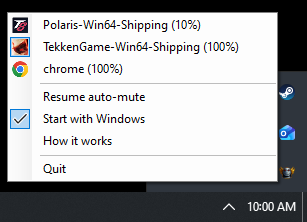

<p align="center">
  
</p>

<h1 align="center">muten</h1>

<p align="center">
  Per-application audio control for Windows.<br/>
  Automatically mute apps when they lose focus and unmute them when you switch back.
</p>

## Features

- **Auto-mute** — managed apps only play sound when their window is active
- **Start with Windows** — optional, toggle from the tray menu
- Settings saved to `%APPDATA%\muten\settings.json`

## Install

Download `muten.zip` from the latest release, extract anywhere, and run `muten.exe`.

## How it Works

<p align="center">
  
</p>

1. Click the tray icon to see audio sessions
2. Click an app to **manage** it (highlighted)
3. Managed apps are only audible when their window is in the foreground
4. Alt-tab away → the managed app mutes. Alt-tab back → it unmutes

Use **Pause auto-mute** / **Resume auto-mute** in the menu to temporarily disable the feature.

## CLI

A companion CLI is included for one-shot commands:

```bash
dotnet run --project src/muten.Cli -- <command>
```

| Command | Description |
|---|---|
| `muten list` | List all active audio sessions |
| `muten mute <name\|pid>` | Mute an application |
| `muten unmute <name\|pid>` | Unmute an application |
| `muten toggle <name\|pid>` | Toggle mute state |
| `muten volume <name\|pid> <0-100>` | Set volume percentage |

You can target apps by **process name** (case-insensitive) or **PID**.

## Building from Source

Requires Windows 10+ and [.NET 8 SDK](https://dotnet.microsoft.com/download/dotnet/8.0).

```bash
# Run during development
dotnet run --project src/muten.Tray

# Build release zip
build.bat
```

`build.bat` publishes a self-contained single-file exe and packages it into `muten.zip`.

## Project Structure

```
muten/
├── muten.sln
├── build.bat                      # Build + zip script
└── src/
    ├── muten.Core/               # Core library (shared by CLI and Tray)
    ├── muten.Cli/                # Command-line interface
    └── muten.Tray/               # System tray application
```

## Tech Stack

- **C# 12 / .NET 8**
- **NAudio 2.2.1** — Windows Core Audio API wrapper
